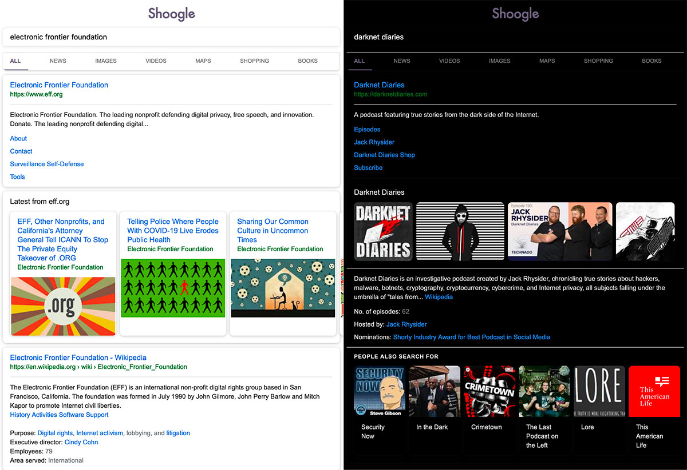

___

[](https://github.com/benbusby/shoogle/releases)
[](https://opensource.org/licenses/MIT)
[](https://travis-ci.com/benbusby/shoogle)
[](https://codebeat.co/projects/github-com-benbusby-shoogle-master)

Get Google search results, but without any ads, javascript, AMP links, or tracking. Easily deployable as a Docker app, and customizable with a single config file. Quick and simple to implement as a primary search engine replacement on both desktop and mobile.

## Screenshots
#### Desktop


#### Mobile


## Prerequisites
- Docker ([Windows](https://docs.docker.com/docker-for-windows/install/), [macOS](https://docs.docker.com/docker-for-mac/install/), [Ubuntu](https://docs.docker.com/engine/install/ubuntu/), [other Linux distros](https://docs.docker.com/engine/install/binaries/))
- [A Heroku Account](https://www.heroku.com/)
  - Optional, but recommended. Allows for free hosting of the web app.
  - Alternatively, you can host the app using a different service, or deploy it to your own server (explained below).
- [Heroku CLI](https://devcenter.heroku.com/articles/heroku-cli)

## Setup
1. Ensure the Docker daemon is running, and is accessible by your user account
  - To add user permissions, you can execute `sudo usermod -aG docker yourusername`
  - Running `docker ps` should return something besides an error. If you encounter an error saying the daemon isn't running, try `sudo systemctl start docker` (Linux) or ensure the docker tool is running (Windows/macOS).
2. Clone and deploy the docker app using a method below:

#### A) Using Heroku (Free)
```bash
heroku login
heroku container:login
git clone https://github.com/benbusby/shoogle.git
cd shoogle
heroku create
heroku container:push web
heroku container:release web
heroku open
```

Now you're done! This series of commands can take a while, but once you run it once, you shouldn't have to run it again. The final command, `heroku open` will launch a tab in your web browser, where you can test out Shoogle and even [set it as your primary search engine](https://github.com/benbusby/shoogle#set-shoogle-as-your-primary-search-engine).

#### B) Using your own server, or alternative container deployment
There are other methods for deploying docker containers that are well outlined in [this article](https://rollout.io/blog/the-shortlist-of-docker-hosting/), but there are too many to describe set up for each here. Generally it should be about the same amount of effort as the Heroku deployment.

Depending on your preferences, you can also deploy the app yourself on your own infrastructure. This route would require a few extra steps:
  - A server (I personally recommend [Digital Ocean](https://www.digitalocean.com/pricing/) or [Linode](https://www.linode.com/pricing/), their cheapest tiers will work fine)
  - Your own URL (I suppose this is optional, but recommended)
  - SSL certificates (free through [Let's Encrypt](https://letsencrypt.org/getting-started/))
  - A bit more experience or willingness to work through issues

## Setup (Local Only)
If you want to test the app out on your own machine first, you can build it with the following instructions:

```bash
git clone https://github.com/benbusby/shoogle.git
cd shoogle
python3 -m venv venv
source venv/bin/activate
pip install -r config/requirements.txt
./run
```

## Usage
Same as most search engines, with the exception of filtering by time range.

To filter by a range of time, append ":past <time>" to the end of your search, where <time> can be `hour`, `day`, `month`, or `year`. Example: `coronavirus updates :past hour`

## Extra Steps
### Set Shoogle as your primary search engine
1. From the main shoogle folder, run `python config/opensearch.py "<your app url>"`
2. Rebuild and release your updated app
  - `heroku container:push web` and then `heroku container:release web`
3. Update browser settings
  - Firefox (Desktop)
    - Navigate to your app's url, and click the 3 dot menu in the address bar. At the bottom, there should be an option to "Add Search Engine". Once you've clicked this, open your Firefox Preferences menu, click "Search" in the left menu, and use the available dropdown to select "Shoogle" from the list.
  - Firefox (Mobile)
    - In the mobile app Settings page, tap "Search" within the "General" section. There should be an option titled "Add Search Engine" to select. It should prompt you to enter a title and search query url - use the following elements to fill out the form:
      - Title: "Shoogle"
      - URL: "https://\<your shoogle url\>/search?q=%s"

### Customizing and Configuration
Shoogle currently allows a few minor configuration settings, accessible from the home page:
  - "Near"
    - Set to a city name to narrow your results to a general geographic region. This can be useful if you rely on being able to search for things like "pizza places" and see results in your city, rather than results from wherever the server is located.
  - Dark Mode
    - Sets background to pure black
  - NoJS Mode (Experimental)
    - Adds a separate link for each search result that will open the webpage without any javascript content served. Can be useful if you're seeking a no-javascript experience on mobile, but otherwise could just be accomplished with a browser plugin.

### Prevent Downtime (Heroku)
Part of the deal with Heroku's free tier is that you're allocated 550 hours/month (meaning it can't stay active 24/7), and the app is temporarily shut down after 30 minutes of inactivity. Once it becomes inactive, any Shoogle searches will still work, but it'll take an extra 10-15 seconds for the app to come back online before displaying the result, which can be frustrating if you're in a hurry.

A good solution for this is to set up a simple cronjob on any device at your home that is consistently powered on and connected to the internet (in my case, a PiHole worked perfectly). All the device needs to do is fetch app content on a consistent basis to keep the app alive in whatever ~17 hour window you want it on (17 hrs * 31 days = 527, meaning you'd still have 23 leftover hours each month if you searched outside of your target window).

For instance: `*/20 7-23 * * * curl https://<your heroku app name>.herokuapp.com > /home/<username>/shoogle-refresh` will fetch the home page of the app every 20 minutes between 7am and midnight, allowing for downtime from midnight to 7am. And again, this wouldn't be a hard limit - you'd still have plenty of remaining hours of uptime each month in case you were searching after this window has closed.

